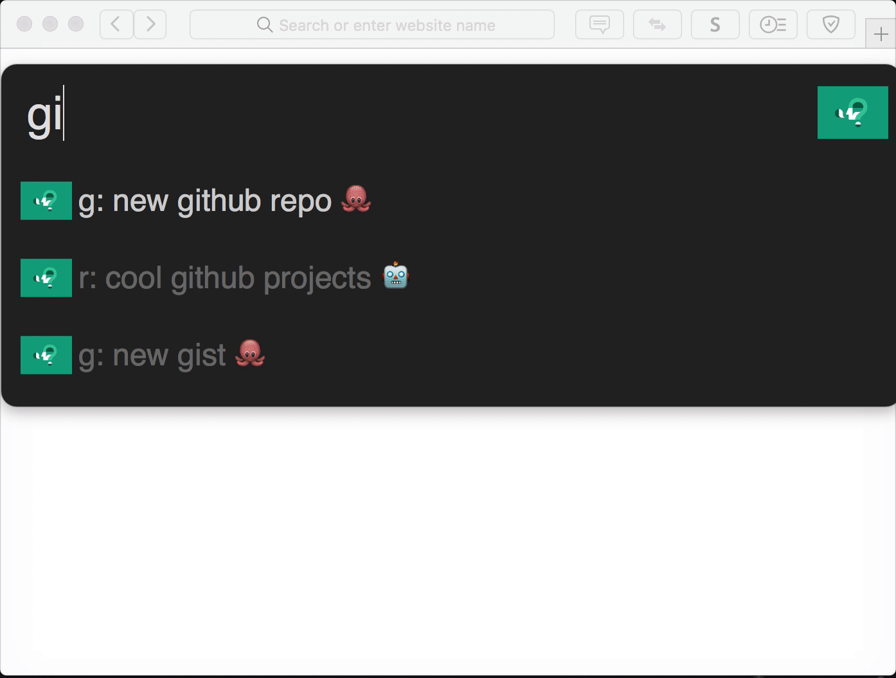

# Alfred Ask Create Share  
> [Alfred](https://www.alfredforum.com/) workflow for creating various Web Submissions (stack exchange, reddit and more)

It is a really fast filter for various online web submissions that you can do.

You can filter submissions by using various prefixes. 

|  prefix |  description |
|---|---|
| s:  |  filter for asking questions on any one of stack exchange sites |
|  r: | filter for creating new threads on various reddit subreddits  |
|  f: |  filter for asking questions on various forums like [Alfred Forum](https://www.alfredforum.com/) |
|  g: |  currently allows you to quickly create new repository or new gist |
|  w: | is for all other websites like creating new hacker news thread or new codepen|
| d:  |  create google docs, sheets, slide or form |

## Install 
Download the workflow from [GitHub releases](https://github.com/nikitavoloboev/alfred-ask-create-share/releases/latest).

## Contribute 
You can [edit the CSV file](https://github.com/nikitavoloboev/alfred-ask-create-share/edit/master/workflow/ask-create-share.csv) and add more web submissions to add to the workflow.

It has a simple structure of argument, followed by comma and then what website is going to be opened.

## Thank you 💜
You can support what I do on [Patreon](https://www.patreon.com/nikitavoloboev) or look [into other repositories](https://my.mindnode.com/ZKGETDkUaQUsL3q8q9z788CxG84oEHgDiT79GuzX#-143.5,-902.6,0) I shared. 